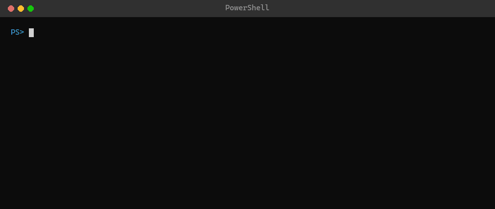

# pwsh-module-template

> An opinionated PowerShell module template — manifest, autoloader, tests, lint, CI, and publish workflow ready to go.

[](https://github.com/razakadam74/pwsh-module-template/generate)
[](LICENSE)

<p align="center">
  
</p>

## What you get

- Cross-platform module skeleton (`src/MyModule/{Public,Private}`) with auto-loader
- `Test-ModuleManifest`-clean `.psd1`
- Sample cmdlet (`Get-Hello`) demonstrating the project conventions
- Pester 5 test suite (module meta + cmdlet tests)
- PSScriptAnalyzer config
- GitHub Actions CI on Windows / macOS / Linux (PowerShell 7+)
- PR + issue templates, CODE_OF_CONDUCT, SECURITY, CHANGELOG
- Bootstrap script that personalises the template in one command

## Prerequisites

- **PowerShell 7+** — the module targets 7.2+ (`PowerShellVersion` in the manifest).
- Git, and optionally the [GitHub CLI](https://cli.github.com/) for the `gh repo create` flow.

Pester and PSScriptAnalyzer install automatically in CI. To run tests or lint locally: `Install-Module Pester, PSScriptAnalyzer`.

## Use it

1. Click **Use this template → Create a new repository** on GitHub, or run:

   ```powershell
   gh repo create my-org/AcmeTools --public --template razakadam74/pwsh-module-template --clone
   cd AcmeTools
   ```

2. Run the bootstrap script to replace placeholders (`{{ModuleName}}`, `{{Author}}`, `{{GitHubUser}}`, `{{Year}}`, `{{ReleaseDate}}`), rename the module folder, regenerate the manifest GUID, and remove itself:

   ```powershell
   .\Initialize-Template.ps1 -ModuleName 'AcmeTools' -Author 'Your Name' -GitHubUser 'your-handle'
   ```

3. Verify it loads:

   ```powershell
   Import-Module .\src\AcmeTools\AcmeTools.psd1 -Force
   Get-Hello -Name 'World'
   Invoke-Pester
   ```

4. Push. CI runs on the first commit.

## How publishing works

Two scripts and one workflow:

- **`.\Build.ps1`** stages `src/<ModuleName>/` into `output/<ModuleName>/` and fills in `FunctionsToExport`.
- **`.\Publish.ps1 -ApiKey <key>`** re-validates the staged manifest and runs `Publish-Module` to the PowerShell Gallery (`-WhatIf` for a dry run).
- **`.github/workflows/publish.yml`** — push a `v*.*.*` tag and CI builds, publishes to the Gallery, and cuts a GitHub Release.

One-time setup before your first release: add a repository secret **`PSGALLERY_API_KEY`** (Settings → Secrets and variables → Actions) with your PowerShell Gallery API key.

## Conventions

- Public cmdlets live in `src/<ModuleName>/Public/`, one function per file, filename matches function name.
- Private helpers live in `src/<ModuleName>/Private/`, auto-loaded but not exported.
- Every public function uses approved verbs (`Get-Verb`), `[CmdletBinding()]`, `[OutputType()]`, and comment-based help.
- Every behaviour change ships with a Pester test.
- Conventional Commits for commit messages.

See [`CONTRIBUTING.md`](CONTRIBUTING.md) for the full development workflow.

## How it compares

No templating engine, no dependencies — just GitHub's "Use this template" button and a one-shot bootstrap script. That keeps it simple, at the cost of the configurability the Plaster-based tools offer.

| | pwsh-module-template | [Catesta](https://www.catesta.dev/) | PSStucco | [Plaster](https://github.com/PowerShellOrg/Plaster) |
|---|---|---|---|---|
| Mechanism | GitHub template + bootstrap | Plaster generator | Plaster template | templating engine |
| Dependencies | none | Plaster | Plaster | — |
| CI/CD | GitHub Actions | GitHub Actions, Azure, AppVeyor, GitLab, etc. | build/test scripts | template-defined |
| Best for | grab-and-go GitHub Actions modules | multi-platform CI choices | strict, standards-driven modules | rolling your own templates |

Want multiple CI providers or lots of options? Use Catesta. Want a minimal, opinionated, GitHub-Actions-first starter? Use this.

## License

[MIT](LICENSE) © Abdul-Razak Adam
